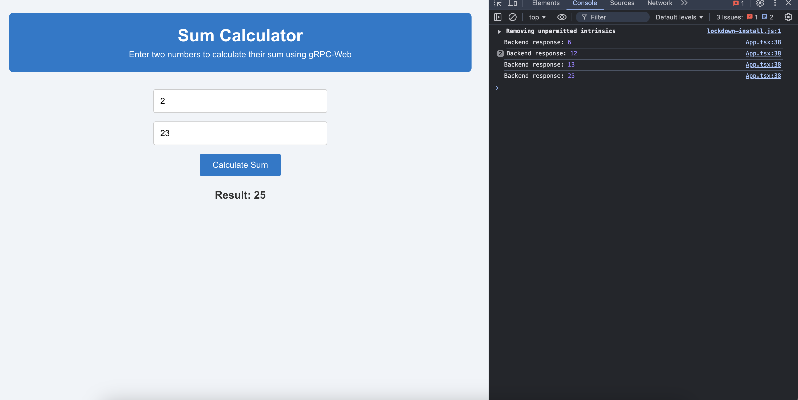

# gRPC Sum Calculator Project


This project demonstrates a simple gRPC-based sum calculator, where two numbers are sent from the frontend to the backend, and the backend returns their sum. Below is an example of how the frontend looks with the console open after performing a calculation:



---

## How to Build and Run

### Build the Docker Containers
1. **Build the containers**:
   ```bash
   docker-compose build --no-cache
   ```
2. **Run the containers**:
   ```bash
   docker-compose up -d
   ```
3. **Verify the containers are running**:
   ```bash
   docker-compose ps
   ```
   Ensure `envoy_proxy`, `grpc_server`, and `react_client` are listed and running.

4. **Check logs for debugging**:
   ```bash
   docker-compose logs -f [envoy/server/client]
   ```
   Replace `[envoy/server/client]` with the service name to view specific logs.

---

## Restart the Containers

To restart the containers, use:

1. **Stop the containers**:
   ```bash
   docker-compose down
   ```
2. **Start them again**:
   ```bash
   docker-compose up -d
   ```

---

## Working with Protobuf Files

### For the Frontend
From the `client` directory, run the following command to generate the necessary JavaScript and TypeScript files for the frontend:
```bash
protoc -I=./src/proto sum.proto \\
  --js_out=import_style=commonjs:./src/proto \\
  --grpc-web_out=import_style=typescript,mode=grpcwebtext:./src/proto
```

### For the Backend
From the `server` directory, run the following command to generate the Go files for the backend:
```bash
protoc -I=./proto ./proto/sum.proto \\
  --go_out=./proto --go_opt=paths=source_relative \\
  --go-grpc_out=./proto --go-grpc_opt=paths=source_relative
```

---

## Example Usage
1. Navigate to `http://localhost:3000` to access the frontend.
2. Enter two numbers in the input fields and click **Calculate Sum**.
3. The sum will be displayed on the page and logged in the browser’s console.

---

## Tech Stack
1. Go Backend
2. React Frontend
3. GRPC

---